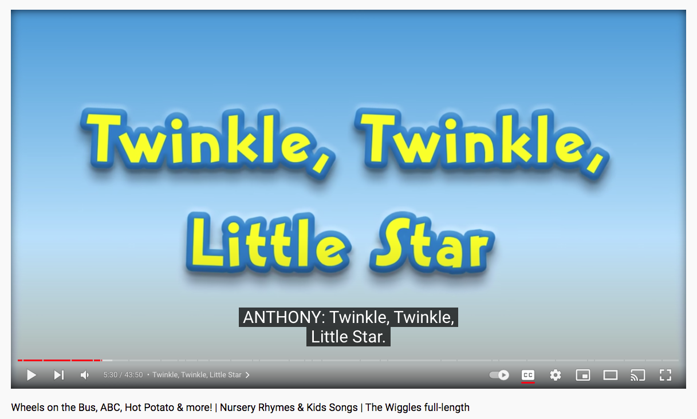

# Marvelous Matching
## Overview

Marvelous Matching is a browser based matching game for pre-school infants and children with learning disabilities.

Designed and tested within a special learning environment with professional guidance from teachers and support staff, Marvelous Matching is a valuable classroom and homeschool, educational resource. 

Thoughtfully designed, the game provides a fun, engaging and satisfying learning experience for its intended audience. 

## Contents
[Planning & Development](https://github.com/davidcalikes/portfolio-project-one/blob/main/README.md#planning--development)

[Features](https://github.com/davidcalikes/portfolio-project-one/blob/main/README.md#features)

[Testing](https://github.com/davidcalikes/portfolio-project-one/blob/main/README.md#testing)

[Deployment](https://github.com/davidcalikes/portfolio-project-one/blob/main/README.md#deployment)

[Languages](https://github.com/davidcalikes/portfolio-project-one/blob/main/README.md#languages)

[Software](https://github.com/davidcalikes/portfolio-project-one/blob/main/README.md#software)

[Media](https://github.com/davidcalikes/portfolio-project-one/blob/main/README.md#media)

[Credits](https://github.com/davidcalikes/portfolio-project-one/blob/main/README.md#credits)

## Planning & Development

- __Project Inception__

    I have always had an innate, practical understanding of computing and technology. Having worked within the field of Special Education for the last 15 years I often feel and act upon a sense of duty to assist pupils and collegues who are having difficulty operating and integrating assitive technologies.

    Marvelous Matching, was developed in response to the following technical challenges faced by the teachers and pupils of St Mary's Special School, Drumcar Co Louth. Eire - my current place of work:   
    
    1. Software reliant on the defunct adobe flash player is now no longer functional.
    2. A significant number of pupils with physical and learning disabilities find most early-learning applications too difficult to interact with.
    3. There are currently no free resources available that offer pupils the chance to match multiple categories within a single application.
    4. There are no resources available that are compatible across multiple platforms. 
    
    
     

    
- __Planning Statement__

    A matching game called 'Marvelous Matching' will be developed to address the issues stated above.

    Marvelous Matching will be a user friendly application that is easy to use and navigate.

    The application will be free to use and functional across multiple devices, browsers and operating systems. 

    The site will help children achieve thier educational goals by addressing key stage learning outcomes.  
    
    The site will offer a stimulating and rewarding library of custom sounds to enhance the users educational experience. 
    
    These sounds will be user controlled and promote interaction and engagement.

    The game will offer users a choice of three separate categories: ‘Animals’, ‘Shapes’, and ‘Colours’ as well as a choice of two game modes: 'Learning' and 'Test'. 
     
- __Target Audience__

    
_Example of just one of the many curriculum links targeted by Marvelous Matching._

 

After consultation with St Mary's Class 5 teacher Caoimhe Brady, we reached the conclusion that matching games are an important resource in helping pupils of all ages within our school achieve the following (Irish Corriculum) learning outcomes:

* Learning Goals.
    * Sorting & Matching
    * Matching Identical Objects.
    * Recognising 'same' and 'different'.
    * Observing 2 dimensional shapes.
    * Recognising irregular shapes (star, oval)
    * Expanding vocabulary. (shape names, colour names, animal, names ect.)
    * Recognising sounds

     

    Whilst the catalyst for the development of Marvelous Matching was due to the exigent needs of the pupils of St Mary's Special School, the site may also prove useful to users outwith special education environments.

    Many parents with young toddlers may also find the application useful for [pre-school learning](https://toysoldier.fun/blogs/just-sharing/benefits-of-playing-matching-games-activities).

    

    Many elderly patients suffering with the effects of [late-stage dementia](https://hospitalnews.com/activities-and-games-for-patients-with-alzheimers-disease/#:~:text=You%20can%20help%20slow%20the,%2C%20functional%2C%20and%20physical%20abilities.) can also benefit from simple matching games.

     
    
- __Target Audiences Summary__
    
    * Users who teach in a Special Education Environment.

    * Users who learn in a Special Education Environment.

    * Users who are parents or carers of pre-school infants.

    * Users who are pre-school infants.

    * Users who have physical or learning disabilites.
    
    * Users who have children with disabilities.

    * Users who care for people with late-stage dementia.

    * Users who are suffering with late-stage dementia.

- __User Stories__

    * As a user, I want to help pupils achieve curriculum-linked learning outcomes.
 
    * As a User, I want to access the game from different platforms.
    
    * As a user, I want to change matching categories without leaving the application.

    * As a user, I want to achieve learning outcomes.

    * As a user, I want to be included in spite of my physical disability.

    * As a user, I want to be stimulated and engaged by pictures and sounds.

    * As a user, I want to help my pre-school child learn

    * As a user, I want to help patients suffering with late-stage dementia.

- __Site Objectives__

    * To offer users a fun, responsive, cross platform matching game. 
    
    * To make the purpose of the site obvious to the user.

    * To assist the user with audible and visual feedback.
    
    * To make the game easy to use and the site easy to navigate.

    * To help users achieve learning outcomes and teaching goals.
    
    * To provide users a positive learning experience.
    
    * To make the game inclusive for people with disabilities.
    
    * To provide exclusive sound content to the user.

    * To provide a game that has more than one matching catagory in a single application.

- __Approach__

    * The information will be provided to the user logically and informed by planning research.  

    * The site will be created following the principles of user experience design.

    * The site will provide users a choice of three matching categories.

    * The site will provide users with the ability to control the sounds of the site.

    * The site will provide users with the ability to chart their progress by enabling a "Test Mode" function.
    
    * The site will provide users with disabilities the opportunity to participate in active learning.

    * The content of the site will be inoffensive and accesible to all.

    * The site will be easy to navigate, intuitive and consistent in design.
    
     

    
 

- __Wireframes__ 

    Desktop, tablet and mobile wireframes were created using Balsamiq software to give a general overview of the layout of the site and to help organise the content logically. An image is posted of the gamepage wireframes below. I thought it unnecessary to create a framework for each game as the layout does not change for each category. A link to the full set of wireframes is available below.

    * [Set of site wireframes](assets/readme_images/wireframes/home_wf.pdf) 
    
     

   
   
    
    The site conforms to the general layout of these frames and only deviates with respect to styling and content. 
 

- __Color Scheme__

    * The background gradient. (#ffffff, #80c7f0, #ffffff)
    
     

    

    The background gradient used is a standard style prevelent throughout early learning environments. Calming and allusive of a clear blue sky the background presents a contrasting perspective for the content of the game area and is not distracting.
    
    

    _Example of blue-white background gradient in other early-learning media._

      #1d5cc9;
      

    * The light blue colored elements of the site contain helpful and informative white text content to guide the user.

     

     #ff0000.
     

    * The red color indicates the question button than can be pressed for an audible clue.
    
     

     #42526e
     

     * The darker blue colour is used for navigation links. (This color was also featured on the website of St Mary's School so I used it here as it may provide reassurance as a color some users are familiar with)
     
      

      #ffff00

    * I tried to avoid using explicit primary and secondary colors as much as possible. This is to avoid any potential confusion for users playing the colours matching game but I made an exeption with yellow as i felt it provided the best contrast and impact for the elements I have targeted with the hover psuedo class.
    
     

    Due to the educational nature of the site and how the content contains multiple vibrant colors I have only included the those used relative to th design of the site framework or those that provide user feedback through consistency of use.

- __Typography__

*  There are two fonts used throughout the site.

    * Schoobell: A fun handwriting novelty font that suits the playful style of the application.
   
    * Helvetica: A clear, professional font is used in the footer developer information and copyright text.

    The fonts were imported to the stylesheet via Google fonts.

# Features #

Below are some features the site currently has to offer and also some features which may be added in future.

## Existing Features ##

- __Main Logo__

    * The Main Logo of the sight is colorful, indicative, and visually pleasing.

    * The Main Logo is available across all five pages of the site.

    * The Main Logo is acts as a hero image for the Menu/Landing page. 
    
    * The Main Logo contains bold, easy to read text using cartoon images that will engage the intended user.

    * The Main Logo contains the alternative (US) spelling of Marvelous consistent with the "synthetic phonics" learning standard. 
 
     

- __Menu Page Navigation Bar__
    
    * The Menu Page Navigation Bar contains the sound toggle switch, a heading element and a link to the sites about page.

    * The Menu Page Navigation Bar establishes a clearly defined style that will be recognisable across the site.

    * The Menu Page Navigation Bar is intuitively designed and instantly recognisable as an interactive feature of the page.

    * The Menu Page Navigation Bar is fully responsive across various screen sizes.

    * The Menu Page Navigation Bar links change background color when user moves a cursor over the element. This provides intuitive visual feedback for the user that the item can be clicked. 
    
     

- __Menu Page Instructions Banner__

    * The Menu Page Instructions Banner provides the user with simple instructions to help them choose a game.

    * The Banner has a blue textured background to indicate its function.

    * The banner contains animated flashing icons to engage users attention.

     

 

- __Game Navigation Bar__  

    * The Menu Page Navigation Bar contains button links to the three different categories of matching game availiable to the user.

    * The Buttons are brightly colored and color coded to each game.

    * Each button contains a rounded border that changes color when user moves a cursor over the element. This provides intuitive visual feedback for the user that the item can be clicked.

    * When the sound toggle switch is set to ON, Each button of the Game Navigation Bar sounds a pleasing pop sound when clicked or tapped to provide audible feedback for the user.
    
     
    

- __The Footer__   

    * The Footer is located at the bottom of all five pages of the site.

    * The Footer section of the site provides copyright, developer information and links to relevant developer pages. The links open in a new tab and contain descriptive title attributes for accessibility. 

     

 
    
- __The Sound Toggle Switch__ 

    * The Sound Toggle Switch allows users to mute and unmute the audio elements of the application. 

    * The Sound Toggle Switch provides user feedback to its state in two ways. By changing its speaker icon and by changing its text content. 

    * The switch is set to OFF by default to enhance user experience.

    * The switch will maintain its state across the different games and pages saving the users preferred option.

    * The Sound Toggle Switch changes background color on hover to provide visual feedback for the user.

     

- __The About Page__ 

    * The about page contains information about the development and functionality of the application.

    * The about page information is presented on a blue textured background consistent in style and presentation with the rest of the site 

    * The about page features photo images of the app used within a learnng environment.

     

- __The Start Game Modal__

    * The Start Game Modal is a pop-up style element which contains information on how to play the game.

    * The Start Game Modal has a blue textured background to indicate it is informative.  

    * The Start Game Modal contains a distinctive button that will make the modal disappear then fire a function to run the game when when clicked. 

     

- __Game Pages__   

    * The three game pages of the site are fully responsive and maintain the same style and design consistency regardless of content.
    
    * Each Game Page is simple to understand with a layout designed to enhance user experience.

    * Each game page contains customary, semantic elements conforming to conventional site structure.

       

- __Game Page Nav Bar__

    * The Game Page Nav Bar provides the user access to the sound toggle switch, a link to return to the main menu and a switch to enable and disable the 'Test Mode' function.

    * The Game Page Nav Bar is fully responsive provides visual user feedback upon hover events.

    * The Game page nav bar maintains a style consitent with the rest of the site.

     

    
- __Upper Game Area__
   

    * The Upper Game Area of the site is part of the main game section of each game page.

    * The Upper Game area contains four random images specific to game catagory.

    * The Upper Game area consists of four images that allow user interaction.

    * Each box will react to a tap or click event.

    * Each box will change border color when hovered over to provide visual feedback for the user.

    * Correct answers display a congratulatory modal element that has a button to reset the game.
    

    * Incorrect answers result in the image being replaced with a 'try again' message (pictured above) and error sound effect.

    * The Upper Game area is fully responsive across a broad variety of screen sizes.

     

    

- __Game Page Instructions Banner__

    * The Game Page Instructions Banner provides the user with simple instructions to help them choose a game.

    * The Banner has a blue textured background to indicate it contains information for the user.

    * The banner contains no flashing icons that may distract users attention.

    * The banner acts as a separator between the upper and lower areas of the main game area.

     

    
    
- __Lower Game Area__
   

    * The Lower Game Area of the site is part of the main game section of each game page.

    * The Lower Game area contains an audible question and a thumbnail image clue, specific to the game category.

    * The Lower Game Area question button provides visual feedback to the user that the link contains audio with a fontawesome speaker icon that changes from unmute to mute with the Sound Toggle Switch.

    * The Thumbnail Image clue reacts to a click event by revealing an overlay image that changes the thumbnails opacity and displays instructive text"

    * The Thumbnail Image clue also provides an audible clue when clicked.
    
    * Each item will change border color when hovered over to provide visual feedback for the user.

     

   
    
- __Test Mode__
   

    * The Test Mode function is fired when the Test Mode toggle switch is set to: ON

    * When in test mode a user can test their matching skills by challenging themselves to get as many correct answers out of ten as possible.

    * When test mode is activated, the game page instructions banner changes to display a scoreboard.

    * When test mode is activated, the game no longer offers the user the try again overlay image and insteads resets the game and logs an attempt to the scoreboard"

    
    
    * When a user completes ten total attempts the congratulatory test modal is displayed informing the user of their final test score

    

     

     

    # Testing

- __Testing During Development__
 
* Responsiveness testing 

    
    I tested the responsivness of the application during the development phase using using the following:

    * Promethean Activboard Interactive Whiteboard. (Firefox for Android)
    

    * HP Pavillion Notebook x360 serving a
    Smart Technologies SB-480 Interactive Whiteboard.

    * Mac Pro with a 21" Apple Cinema display -- Safari, Chrome and Firefox

    * Macbook pro 13" -- Safari, Chrome and Firefox

    * Toshiba Satellite Pro Laptop 15" (Windows 10) -- Edge, Chrome and Firefox

    * Apple iPad Mini (5th gen) -- Safari and Chrome
    

    * Apple iPad (2nd gen -- Safari)
    

    * Huawei P20 Pro Android Phone -- Chrome and Firefox.

    * Various android tablet devices.
    

    I also used Google Dev-tools to test the sites responsivness by emulating the sites appearance across other device screen sizes.

    

    At the time of testing, the site was fully responsive across Chrome, Firefox and Safari browsers on all of the above devices with the exeption of the following:

    * The Promethean Activboard would not display box items correctly in the Chromium web browser.

    * The site would not load box images or display correctly on the older iPad2 running ios 9.

    * The site is not practically useable on mobile devices in landscape mode.

     

- __Style Error__

    

    One of the first rendering errors i came across was an error that cause the drop shadow filter effect to break on mobile devices.

    After searching for a solution on [Stack Overflow](https://stackoverflow.com/questions/65801487/drop-shadow-not-working-properly-on-ios-safari) I fixed this issue by using a box-shadow effect instead.

     

- __Feature Testing__

    I first tested each individual function of the first Nav section of the menu page.

    * Sound Toggle

The Sound Toggle feature of the site threw up a few issues during development. Initially the switch functioned correctly on each page with the default setting of: OFF to enhance user experience. 

A problem arose however when users would navigate to a different page of the site. The Sound Toggle would return to the default OFF position.

Whilst it remains good UX design for default sound settings to be muted when the application first loads, I realised this would become tiresome and lead to a poor user experience if they had to constantly keep changing the switch state to achieve their desired sound setting. 

I found a solution to this problem on [Youtube](https://www.youtube.com/watch?v=NQMs0rn6kwM). By storing string data to Local Storage I was able to call a function that set the sound toggle depending on the data contained within Local Storage. I was also able to maintain a default mute position by using the null keyword. 

I logged the string data from Local Storage to the console using Google Dev Tools to test this function during development. 

Despite this appearing to solve this problem, the console returned another error with the sound toggle as I added more features to the site.

When I added a fontawesome speaker icon to the question button of each game page (to visual provide feedback for the user), I came across the following error.

A problem was reported to the console when users would visit the menu page or about page as the Sound Toggle function would target an element that did not exist on these pages.

I resolved this issue by including an element on each page (pictured above) and set the display style property to 'none'

 

*  Main Menu Buttons Testing

I had initially intended to have a simple sound function that would play a sound when a click event called it from the DOM. I encountered a problem however when using sounds when loading pages, the pages would often load and clip the sound before it is heard or sometimes it might not be heard at all. 

I fixed this error by developing a function that loads each page only after the sound effect has ended.

* About page Testing

I tested the link to the about page on the menu page and it opened at the correct destination. The About page nav links work, images load and the text content is free from gramattical errors.

* Footer Testing

The footer meets accessibility contrast and title attribute requirements. Both links work and open in a new browser tag. The footer was tested across all site pages.

* Game Page Testing

I encountered and overcame many errors and bugs during the development of the game page.

 
    

* Typo Errors

    * The first typo error I encountered provided the question button with the wrong animal type when playing the animals matching game. 
    (pictured above)

    * 

    * I found the offending error in the if else statements of the rungame function and corrected it.

    * The second typo error I found was playing the colours matching game. The Thumbnail image provided no audible user feedback.

    

    * This error was solved by changing the capitalisation error pictured here.

     

- __Test Mode Errors__

I encountered a few tricky errors when the test mode function was applied to the game. 

* Attempts Error

    * When developing the test mode function of the game I created a rule that when ten attempts had been reached the Test Mode Congratulations Modal Would appear and provide the user with a final score. 

    * The error I discovered via testing was that the Test modal would fire even when the game was not in test mode.

    * I solved this problem by adding a second condition to the "tenCheck" JavaScript Function". (pictured above)

* Error in Shapes Game -- Test Mode
    
    * When developing the test mode function of the shapes game I discovered an error where the game would not refresh the flash card box elements when the test mode function was called.

    * 

    * I found the issue here was a rougue space in the inner html of the element the JavaScript code was targeting. (facepalm emoji)

    * 

     

* Further Testing of The Game Page
    
    * I tested each of the nav elements of every Game Page and each element functions properly.

    * I created the following test sequence for rigorous testing of all box elements across all game categories and modes.

    * The testing sequence is as follows:
        
        * Each box is clicked 10 times (To test for repeat of tenCheck function error)

        * The score will be logged for each box out of 10 in both game modes

        * Question Button and Thumbnail image results will be logged out of forty if they render correctly, match each other and match the correct box image every time.

        * Box Errors and Lower Game section errors will be logged in an errors section underneath the table.

|                 | Animals | Shapes | Colours | Animals Test | Shapes Test | Colours Test | CT Modal Fired?       |
|-----------------|---------|--------|---------|--------------|-------------|--------------|-----------------------|
| box1            | 2/10    | 2/10   | 3/10    | 5/10         | 0/10        | 4/10         | Yes(A) Yes(Sh) Yes(C) |
| box2            | 4/10    | 3/10   | 1/10    | 0/10         | 3/10        | 1/10         | Yes(A) Yes(Sh) Yes(C) |
| box3            | 2/10    | 2/10   | 3/10    | 1/10         | 4/10        | 1/10         | Yes(A) Yes(Sh) Yes(C) |
| box4            | 4/10    | 3/10   | 1/10    | 3/10         | 4/10        | 3/10         | Yes(A) Yes(Sh) Yes(C) |
| Question Button | 40/40   | 40/40  | 40/40   | 40/40        | 40/40       | 40/40        | N/A                   |
| Thumbnail Image | 40/40   | 40/40  | 40/40   | 40/40        | 40/40       | 40/40        | N/A                   |

 

The results of sequence testing returned no further errors.

 

- __Practical Testing__

* Marvelous Matching was tested by the pupils of St Mary's Special School in Drumcar, Co.Louth in the North East Of Ireland. Under the supervision and guidance of Vice-Principal Mr Declan McCoy, 4 Classes took part in testing the application: 

    * Class 5: Teacher -- Caoimhe Brady.
    * Class 7: Teacher -- Colin McKee.
    * The Rainbow Class: Teacher -- Rosin Donnelly.
    * Declan's Class: Teaching Vice-Principal -- Declan McCoy.

The following feedback was recieved from each class:

Class 5: 

* The Pupils enjoyed Marvelous Matching.
* The Pupils used Marvelous Matching on the interactive whiteboard.
* 
* The Pupils found Marvelous Matching challenging.
* The Pupils mostly enjoyed the 'Animals' category.
* The application is a valuable teaching resource.

 

Class 7: 

* The Pupils enjoyed Marvelous Matching.
* Several Pupils took an interest in matching games for the first time.
* The Pupils used the application on the interactive whiteboard and android tablet.
* 
* Marvelous Matching is an ideal replacement for outdated Flash Games.

 

The Rainbow Class:

* The Pupils enjoyed Marvelous Matching.
* The thumbnail image is a little small on the class tablet.
* 
* The Pupils used the application on the interactive whiteboard and android tablet.
* The application is accessible for all of the pupils to use.
* Marvelous Matching is great fun and the voice sounds are 'adorable'.

 

Declan's Class:

* The Pupils enjoyed Marvelous Matching.
* One of the pupils tried to swipe the images instead of tapping.
* The Pupils enjoyed using the application on the interactive whiteboard.
* The application was of inclusive and of great benefit to two children in particular who cannot swipe the whiteboard due to their physical disabilities.
* 
* The Start Game Modal was confusing. Both pupils and support staff tried to push the rules images to start the game.
* The Pupils mostly enjoyed the animals game and loved the audio elements.

 

- __More Practical Testing__

* Test subject: My son Lochlainn Calikes  
* Age: 7 months

Lochlainn loved looking at the app and passively enjoying the sounds, colours and biting the corner of the tablet. :)

 

- __Validator Testing__

I ran all of the sites pages through the W3C validator and each page returned multiple errors.

I corrected the code and all four pages now return no html errors.

* The CSS stylesheet was passed through the Jigsaw Validator and returned no errors.

 

- __Performance Testing__

    I used Lighthouse to check site performance. The site performs well in most areas however the accesibility score was less than optimal.

    I then used the WCAG color contrast checker tool and it returned contrast errors with the deep orange color in the site's color scheme returning a contrast ratio of less than 3.0.

This was addressed by implementing a brighter orange color for text elements and links within the site. 

The site now returns just one contrasting error which is associated with the gradient I have used on the site's sub-headings. I have chosen to ignore this contrast warning as the image provided shows there is no visibility issue whatsoever and the error message appears to be simply a limitation of the WCAG's abilities.

The site now achieves a 100% accesibility rating when performance is tested through lighthouse.

 

- __Other Bug Fixes__

    * On some touchscreen devices an error occurs due to the hover psuedo class which fails to deselect a nav link when a user returns to the previous page via the back arrow.
    
     

    This bug was fixed by the inclusion of the "inactive" class selector and by setting the nav link elements to display=hidden on smaller screen sizes. 
    
     

     

 

- __Unfixed Bugs__
 
 Although there are no known bugs present within the site, I have left this section of the README file for cataloguing and fixing future bugs.

# Deployment

* The site was deployed to GitHub pages. The steps to deploy are as follows:
    * From this project's repository, navigate to the settings tab
    * From the left hand menu, select pages.
    * From the source section drop-down menu, select the Main Branch.
    * Once the main branch has been selected, the page will refresh and provide a link to the live project. 

The live link can be found here - https://davidcalikes.github.io/portfolio-project-one/index.html

   
# Languages

* The coding languages used to create this site were HTML and CSS.

     

# Software

* Gitpod to create, load and push my code to Github.

* Git, (Gitpod and Github) as my version control system for the site.
    
* Adobe Photoshop CS6 to edit some images. I mainly used Photoshop to add greyscale to color-photos and to create color gradient effects for background images.

* TinyPNG to compress web images.

* Fotojet online image editor to add polaroid style borders to my image files, providing a consistant style across the site.

* Logic Pro X to produce and master the mp3 files.
    
    

* Balsamiq wireframes software.

# Media

* The youtube video provided is used with the expressed written permission of Nexstar media. (formerly Fox46)

    

* The songs featured in the audio section of this site were written and produced by myself, David Calikes in 2016.

* The images featuring the band Cumasc Gael are used with the permission of David Calikes, Andrew Kelly and Liam Sheridan.

* The logo image of the band Cumasc Gael was designed by myself David Calikes in 2016

* The following images were aquired from public domain image site Pexels.com

    
    
    
    

# Credits

- __Content__

    * The navigation section of this site is loosely based on a code snippet named "flex-test" provided to me by my Code Institute mentor Richard Wells.

    * The fade-in effect for the hero image is from this article on Stack Overflow: https://stackoverflow.com/questions/11679567/using-css-for-a-fade-in-effect-on-page-load

    * The Sticky Navigation Menu is derived from snippets of code from this repository: https://github.com/iamshaunjp/CSS-Tips-and-Tricks/blob/04-css-only-dropdown-menu/css-only-dropdown/styles.css

    * The form on the site is inspired by the Code Institute's Coders Coffeehouse code along project.

    * The CSS styling used to hide the labels of the form inputs was derived from this tutorial: https://webaim.org/techniques/css/invisiblecontent/

    * All text icons used on the site were sourced from: https://fontawesome.com/search?m=freecom

    * The link to the favicon icon on all four pages is from: https://favicon.io/

- __Thanks__

    * Kasia Boguka: Code Institute Cohort Facilitator.

        Kasia is seemingly always available to chat code and always leaves me feeling more confident about my progress as a developer whenever we talk. I'll never fully understand people who prefer Tea to Coffee but Kasia makes me at least want to try... ;)

    * Richard Wells: Code Institute Mentor.

        Richard's expertise during this project was invaluable and my project benefitted greatly due to his mentorship. 
        Richard was also extremely generous with his time and our online sessions would often overun. For this I am truly grateful.

    * Helen Mill: Code Institute Admissions Executive
    
        I count myself extremely fortunate to have been afforded the opportunity to study with the Code Institute and would like to thank Helen for giving me the chance.

    * Liam Sheridan and Andrew Kelly (Cumasc Gael)
    
        Our wee American adventure many moons ago was hugely enjoyable and I am priveliged to have worked with such outstanding musicians. 

    * Michelle Calikes
    
        I am hugely thankful for the time my wife has afforded me to work on this project. Thank you Michelle from the bottom of my heart. 
    

 

